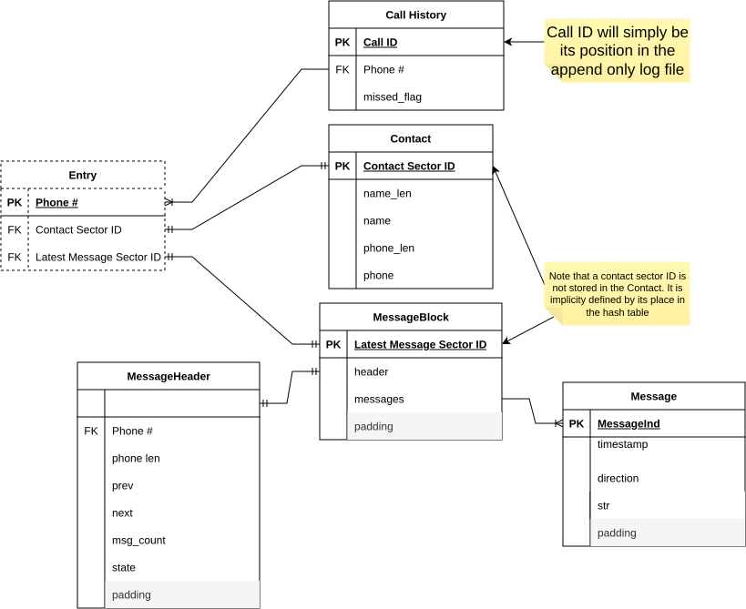
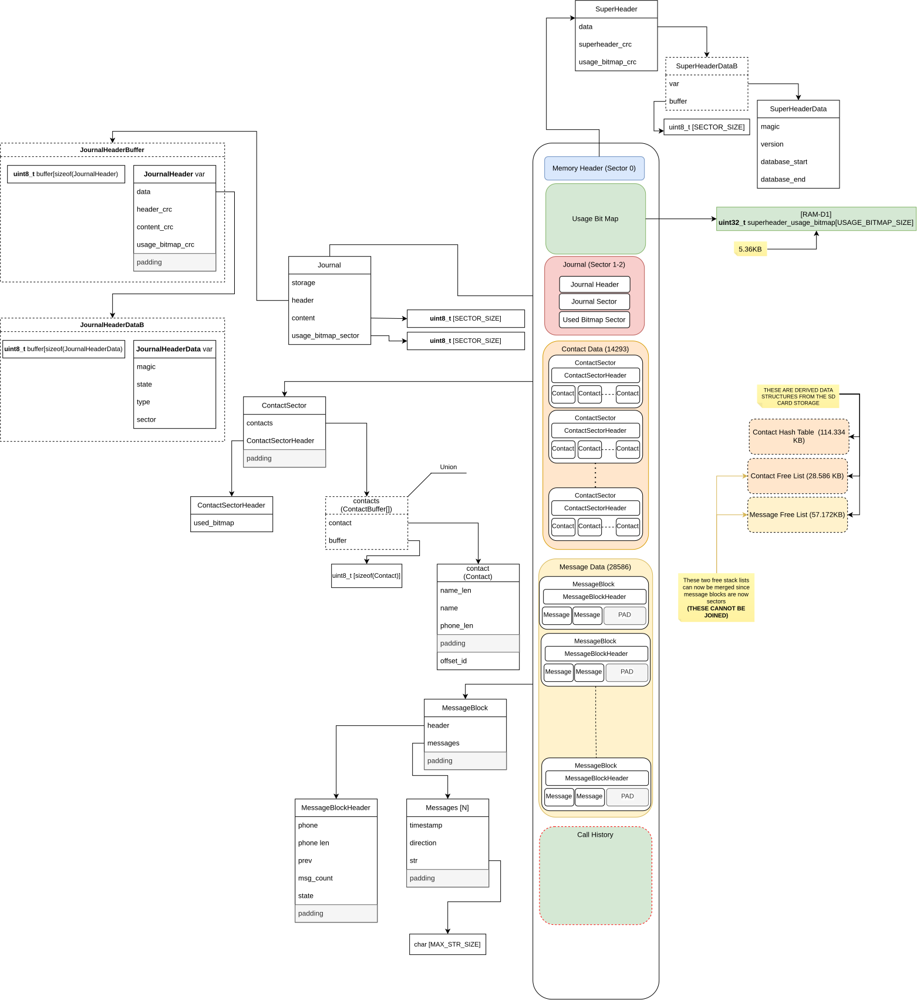
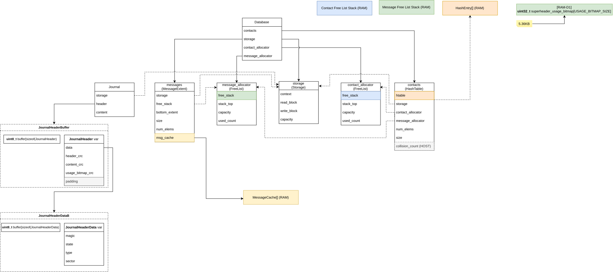
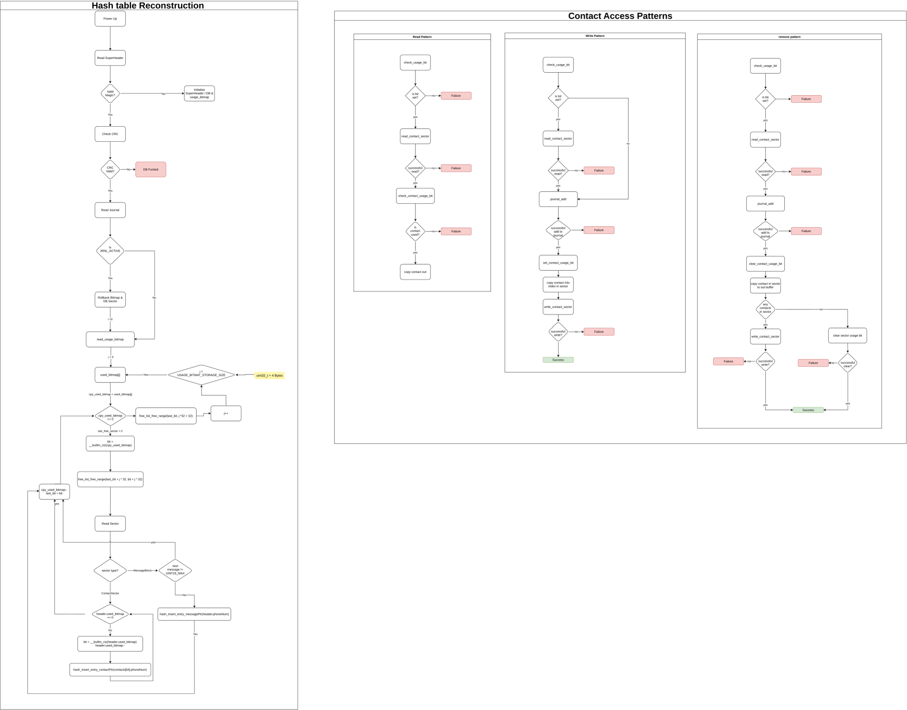
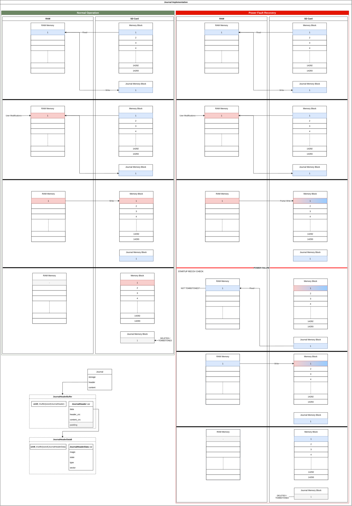
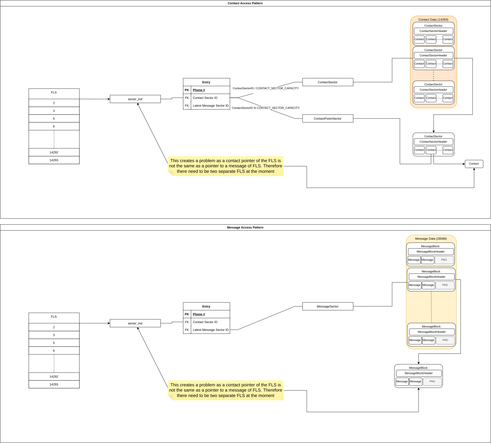
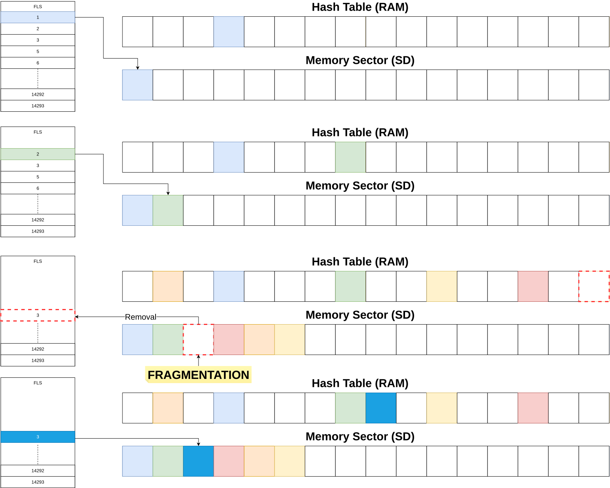
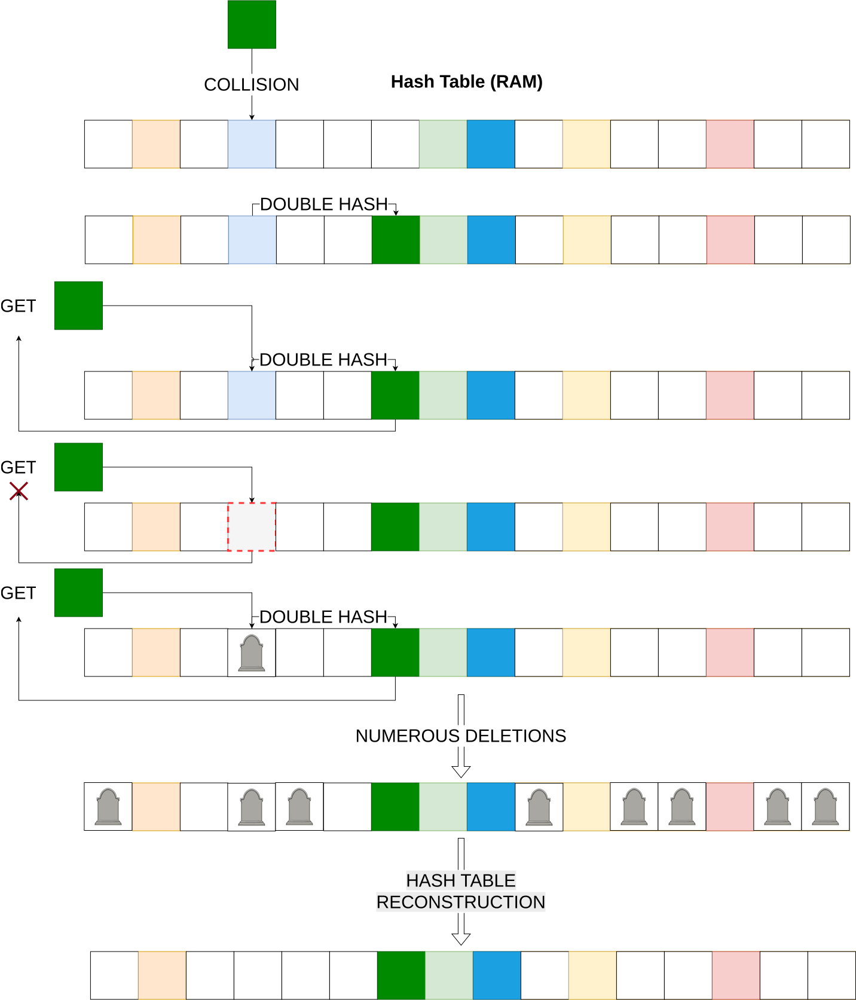

# SD-DB-Dev
SD Card database development for the STM32H723. The current database is design to be able to manage 10,000 contacts and twice as many messages. The message size is an arbitrary size which can be increased with little impact of the database performance.

General infromation about the database:
- **Hash Table Size**: 14293
- **Load Capacity of Full**: 70%
- **Hashing Method**: DBJ2
- **Hashing Input**: Phone Number
- **Collision Handling Method**: Double Hashing with tombstoning

Memory Sizing:
- **Sector Size**: 512B
- **Contact Size**: 81B
- **Contact Sector Capcity**: 6
- **Message Size**: 164B
- **Message Sector Capacity**: 2
## Contents
- [Relational Model](#relational-model)
- [SD Card Structure](#sd-card-structure)
- [Data Structures](#data-structures)
- [Hash Table Reconstruction](#hash-table-reconstruction)
- [Rollback Journal](#rollback-journal)
- [Message and Contact Access](#message-and-contact-access-pattern)
- [Collission Handling and Tombstone Cleanup](#collission-handling-and-tombstone-cleanup)

## Relational Model
Below is the relational model of the phone database. Note that **Entry** is an index with the foreign keys that point to contacts and messages through there sector indexes (See [Message and Contact Access](#message-and-contact-access-pattern)). The hash entry is hashed based on the **Phone #**, using DBJ2 and double hashing.

## SD Card Structure
The SD card is broken up into memory blocks. Each memory block is a number of sector. For example the *superheader* is one sector, whilst the contact data memory block is HASH_TABLE_SIZE / CONTACT_SECTOR_CAPACITY.

## Data Structures
The is a total of **200.092KB/320KB** being used in RAM_D1 (AXI SRAM), which is the largest RAM storage on the STM32H723, for hash table and FLS storage.

## Hash Table Reconstruction
To enable persistant storage and syncronisation of the in RAM Hash Table with the SD card memory, on start up, the Hash Table is reconstructed. This reconstruction, illustrated in the left flow chart below, involves:
1. Searching through a usage bitmap which denotes if a sector is currently being used on the sd card or not (0 = not used, 1 =used)
2. For each unused sector, the sector index associated with said bit is placed back on the *Free List Stack (FLS)* (See [Defragmentation Solution](#defragmentation-solution))
3. For each used sector, the sector is read and added to the in RAM Hash Table as a Hash Entry.
    - **Contact**: For a contact sector, each contact in the contact sector is read, then the phone number is hashed to find the associated Hash Entry. That entry is then set to *OCCUPIED* and entries contact sector index it set to the associated index.
    - **Message**: For a message sector, finding of the Hash Entry is the same. The message sector is then checked if it doesn't point to another message (meaning it is the latest message associated with the phone number), if so add message sector index to said Hash Entry.

## Rollback Journal
To maintain a valid database throughout power faults and write fails a rollback journal was implemented to restore the database to the previous valid state before attemping a change. This ensures a safe and robust database, see below the two journal scenarios for both successful read and write and an unsuccessful read and write. Also see start of [Hash Table Reconstruction](#hash-table-reconstruction) flow chart to highlight the journal validation and check to rollback the database if a fault has occurred. A rollback happens if the journal is still in the *ACTIVE* state on powerup and not the *EMPTY* or *COMMITTED* state.

## Message and Contact Access Pattern
The message and contacts are broken into two separate static memory blocks. This is done because the sector structure for messages and contacts are very different and are indexed by the *FLS* differently.

For contacts, there are six contacts per sector. Therefore, as seen below, the actual index of a contact is not the index of the sector but of the index inside a sector. Messages on the other hand are given whole sectors as their sector index. This is also why in [Data Structures](#data-structures) there are two FLSs.

## Defragmentation Solution
To maximise storage efficiency on the SD card whilst allowing removal of data a defragmentation stradegy needed to be introduced. This defragmentation stragedy is the use of a *Free List Stack (FLS)*. This is a stack which stores free sector indexes which can be written to. When a new contact or message sector is needed the FLS would *pop* the top index off the stack. This will sequentially allocate memory as more sectors are *popped* of the top of the stack. However, when you want to delete a contact or message sector, you would *push* the index pack to the top of the stack. This will allow that now empty sector to be filled up by the next new contact or message sector ensuring the memory remains compact and unfragmented.

## Collission Handling and Tombstone Cleanup
When using a hash table, collision handling is an important issue that needs to be addressed. Due to the fact that memory is scarce on the STM32H723 cuckoo hashing was not used due to it's increased memory consumption. After performing simulations on linear probing vs double hashing (simple and effective methods for this application) double hashing was implemented. However, there is one significant drawback with double hashing, and that is the effect load capacity still increases even with deletion of entry due to tombstoning. Tombstoning is required to allow access to entry which has collided and needed to be double hashed.

