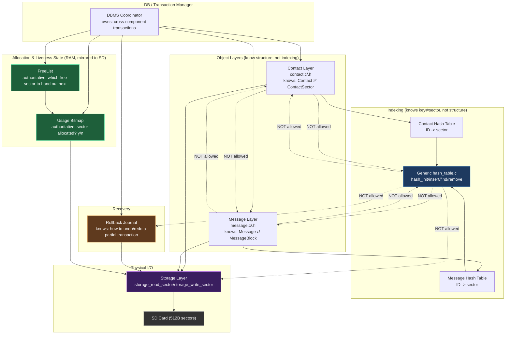
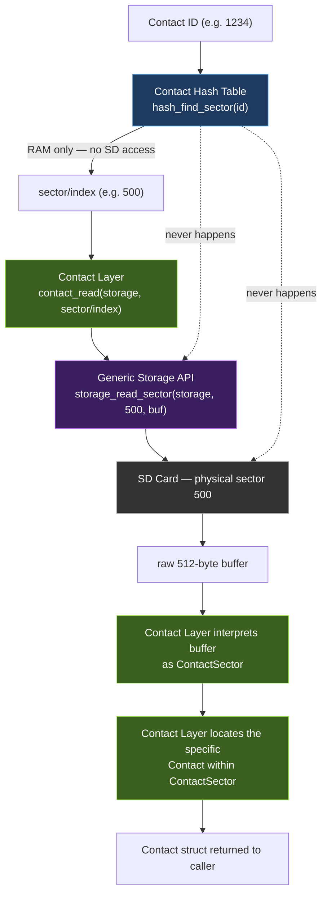
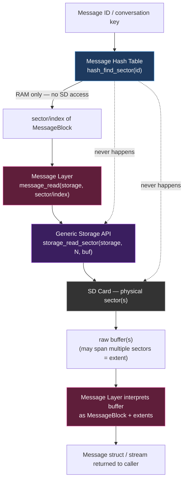
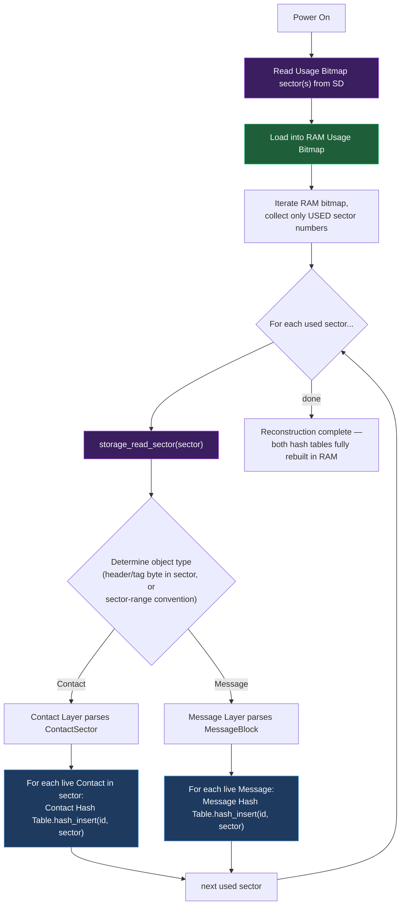
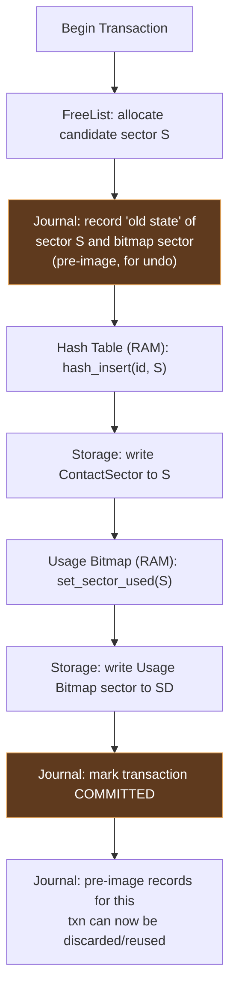
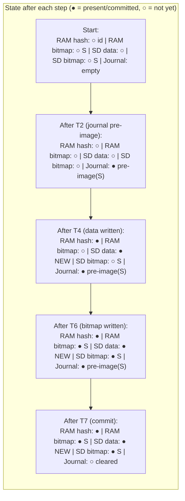
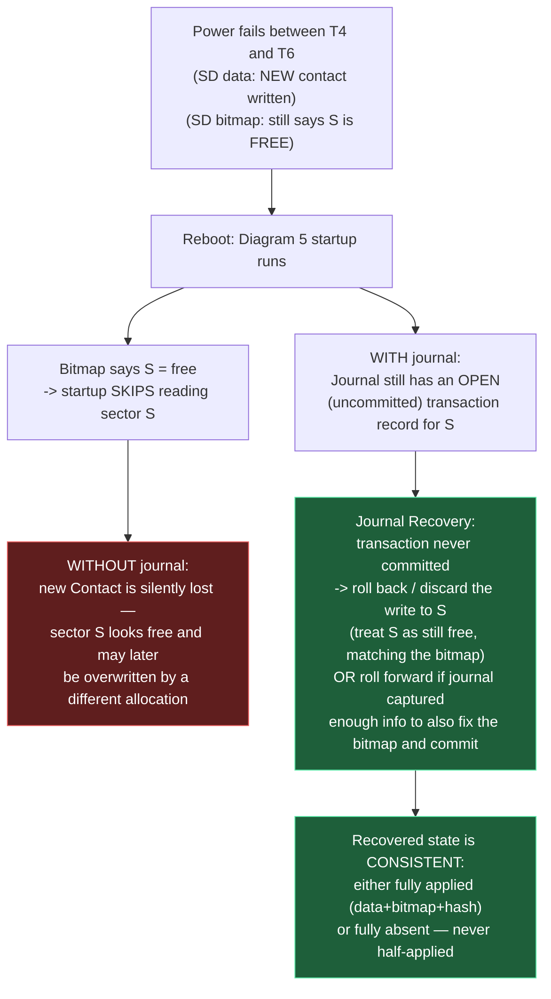
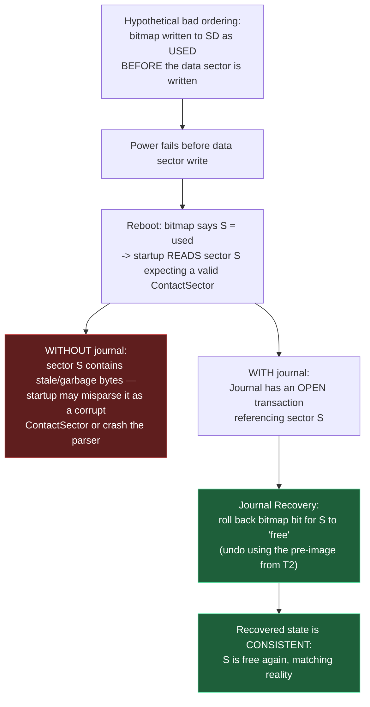

# RTDBMS Architecture Diagrams — Hash Table Decoupling

This document contains six Mermaid diagrams plus an analysis of the module
boundaries for the STM32H7 RTDBMS refactor. Paste any diagram block into
[mermaid.live](https://mermaid.live) to render/edit it.

---

## Diagram 1 — High-Level Architecture & Dependency Direction

Arrows mean "depends on" / "calls into." Dotted red arrows mark dependencies
that must **not** exist after the refactor.



**Read this diagram as:** the hash table core (blue) sits in the middle of the
picture but has the *fewest* outgoing solid arrows — it only calls into
nothing external, it only gets called. Storage (purple) is a leaf — everything
above it depends on it, it depends on nothing above it.

---

## Diagram 2 — Contact Lookup Flow



The hash table's job ends at step C. Everything from D onward — including the
fact that a "sector" is subdivided into multiple Contact slots via a bitmap
header — is Contact Layer knowledge. The hash table never sees a `Contact`,
a `ContactSector`, or a `ContactSectorBuffer`.

---

## Diagram 3 — Message Lookup Flow



Notice this diagram is structurally identical to Diagram 2 except the boxes
colored pink (Message Layer) replace the boxes colored green (Contact Layer).
**That symmetry is the entire point of the refactor** — the generic
`hash_table.c` (blue) code is byte-for-byte reusable between the two, because
it never had structure-specific logic in the first place. The Message layer
also introduces "extents" (a message can span >1 sector) — that complexity is
fully contained inside the Message Layer box and invisible to the hash table.

---

## Diagram 4 — New Object Allocation (RAM vs SD Operations)

```mermaid
flowchart TD
    START["request: insert new object<br/>(Contact or Message)"] --> HT["Hash Table<br/>checks: is ID already present?"]
    HT -->|"not present, need new location"| FL["FreeList<br/>find_free_sector()"]

    subgraph RAMOPS["RAM-only operations (fast, no SD latency)"]
        FL --> BMCHECK["Usage Bitmap<br/>is_sector_used(candidate)? (RAM copy)"]
        BMCHECK -->|"free"| SECPICK["sector chosen"]
        HTINSERT["Hash Table<br/>hash_insert(id, sector) — RAM only"]
        BMSET["Usage Bitmap<br/>set_sector_used(sector) — RAM copy updated"]
    end

    SECPICK --> HTINSERT
    HTINSERT --> OBJWRITE

    subgraph SDOPS["SD-card operations (slow, must be journaled)"]
        OBJWRITE["Object Layer<br/>contact_write() / message_write()"]
        OBJWRITE --> STORE1["Storage Layer<br/>storage_write_sector(data sector)"]
        STORE1 --> SD1["SD Card: data sector written"]
        BMSET --> STORE2["Storage Layer<br/>storage_write_sector(bitmap sector)"]
        STORE2 --> SD2["SD Card: bitmap sector written"]
    end

    SD1 --> COMMIT["Journal: commit transaction"]
    SD2 --> COMMIT
    BMSET --> COMMIT

    style RAMOPS fill:#0d2818,stroke:#3ab06e
    style SDOPS fill:#2d1808,stroke:#e08030
    style HT fill:#1e3a5f,stroke:#5da9e9,color:#fff
    style HTINSERT fill:#1e3a5f,stroke:#5da9e9,color:#fff
    style FL fill:#1e5f3a,stroke:#5de9a9,color:#fff
    style BMCHECK fill:#1e5f3a,stroke:#5de9a9,color:#fff
    style BMSET fill:#1e5f3a,stroke:#5de9a9,color:#fff
```



Key point: **FreeList consults the Usage Bitmap, not the other way around.**
The bitmap is the single source of truth for "is this sector allocated." The
FreeList's job is purely to make finding a free sector fast (e.g. a
next-free-hint or free-run cache) — it should never disagree with the bitmap
about allocation state. See the analysis section for how to avoid two sources
of truth.

---

## Diagram 5 — Startup / Reconstruction



The whole reason the bitmap is loaded first is visible here: without it, step
D would have to be "iterate over *every* sector on the card," which is the
exact SD-card-sized full scan the architecture is designed to avoid. The
bitmap turns startup cost from *O(card size)* into *O(used sectors)*.

One open design question flagged for you: step G ("determine object type")
needs *some* discriminator. Options: a type tag byte in each sector's header,
or partitioning sector ranges by type (e.g. sectors 0–99999 reserved for
Contacts, 100000+ for Messages) so the sector number alone implies type. The
diagram assumes a header tag; if you instead use range partitioning, step G
becomes a cheap range comparison instead of a sector read — worth considering
since it removes a decision branch from every reconstruction pass.

---

## Diagram 6 — Transaction / Rollback Flow

### 6a. Happy path — inserting a new Contact



### 6b. State table across the three "planes" at each step



### 6c. Failure case — power lost after data write, before bitmap write

This is your "data sector written, bitmap not" case from Diagram/Section 18.



### 6d. Failure case — power lost after bitmap write, before... (shouldn't happen, but shown for completeness: bitmap written, data not)



**Practical takeaway from 6c vs 6d:** ordering the writes so the *data*
sector is written before the *bitmap* sector (as in 6a: T4 then T6) is safer
by default, because the failure mode in 6c ("bitmap says free, data exists")
is silently recoverable — worst case, you leak a written-but-unindexed sector
until the journal or a later GC pass reclaims it. The failure mode in 6d
("bitmap says used, data doesn't exist") is more dangerous — a parser can
choke on garbage. The journal should make either ordering safe, but choosing
data-before-bitmap gives you a cheaper fallback if the journal itself were
ever incomplete.

---

## Analysis

### 1. Dependencies that should exist

- `contact.c` → `storage.h` (Contact Layer performs sector I/O through Storage)
- `message.c` → `storage.h`
- `contact.c` → `hash_table.h` *only if* you keep a thin `contact_hash.c`
  wrapper; otherwise the DB/Tx layer glues Contact Layer + generic hash table
  together and `contact.c` doesn't need to include `hash_table.h` at all.
- `journal.c` → `storage.h` (journal persists its own log records as sectors)
- `freelist.c` → `bitmap.h` (FreeList consults bitmap state)
- `db.c` (the DB/Tx manager) → `contact.h`, `message.h`, `hash_table.h`,
  `bitmap.h`, `freelist.h`, `journal.h`, `storage.h` — this is the one module
  allowed to know about everyone, because its entire job is coordination.

### 2. Dependencies that should NOT exist

- `hash_table.c` → `storage.h` — remove entirely. Delete `Storage *` from
  `HashTable`.
- `hash_table.c` → `contact.h` / `message.h` — this is the coupling you're
  fixing.
- `hash_table.c` → `journal.h` — the hash table's RAM-only mutations don't
  need journaling *themselves*; the DB/Tx layer journals the sector writes
  that the hash table's decisions correspond to.
- `contact.c` → `message.h` and vice versa — no reason for these to know
  about each other; both are peers under the DB/Tx layer.
- `bitmap.c` → `contact.h` / `message.h` — the bitmap only knows sector
  numbers, never object types.
- `storage.c` → anything above it — Storage must stay a leaf dependency.

### 3. Should `Storage *` live inside `HashTable`?

No. Remove it. The only reason it's there today is because
`hash_insert_contact()` etc. perform I/O directly from within the hash-table
module. Once `contact_read/write/remove` own that I/O, `HashTable` never
touches a `Storage*` and the struct should shrink back down to whatever it
needs for pure key→sector bookkeeping (arrays/table size/entry state).

### 4. Should `Journal *` live inside `HashTable`?

No, for the same reason. The hash table's RAM mutations are *derived* state —
they get rebuilt for free at startup from persistent state (Diagram 5). What
actually needs journaling is the *persistent* mutation (the sector write, the
bitmap write). So `Journal*` belongs in whichever layer performs persistent
writes as part of a multi-step operation — that's the DB/Tx layer (and
transitively the Storage/Bitmap layers it drives), not the hash table.

### 5. Who should control the Usage Bitmap: Hash Table, Storage, or a higher DB/Tx layer?

A higher DB/Tx layer (or a dedicated `bitmap.c` module the DB/Tx layer calls
into). Reasoning:

- The Hash Table shouldn't own it because the bitmap's meaning ("is this
  sector allocated") is orthogonal to indexing ("what ID maps to this
  sector") — a sector can be allocated without being in any hash table yet
  (e.g. mid-transaction), and the hash table has no natural reason to know
  about persistence/journaling.
- The Storage Layer shouldn't own it because Storage is deliberately dumb —
  it reads/writes bytes at a sector number and must not interpret them.
- A dedicated `bitmap.c` (called by the DB/Tx layer, and by FreeList for
  read-only queries) is the natural owner: it knows the RAM/SD duality
  described in Diagram/Section 8, and the DB/Tx layer decides *when* bitmap
  changes get folded into a journaled transaction.

### 6. Do FreeList and Usage Bitmap overlap in responsibility?

They're related but should have a strict one-way relationship, not two
sources of truth:

- **Usage Bitmap = authoritative state.** "Is sector N allocated?" has
  exactly one true answer, and it lives in the bitmap (RAM copy, mirrored to
  SD).
- **FreeList = a search accelerator, not a second state store.** Its job is
  "find me a free sector quickly" — e.g., a cached next-free pointer, a stack
  of recently-freed sectors, or a per-region free-run count. It should either
  (a) be derived from the bitmap on demand / rebuilt at startup, or (b) if
  cached for speed, be treated as a *hint* that is always re-verified against
  the bitmap before being trusted (`is_sector_used()` check before handing a
  sector out — as shown in Diagram 4).

If the FreeList instead maintains its own independent "is this sector free"
flag that isn't the bitmap, you now have two sources of truth that can drift
apart after a crash — avoid that. Simplest safe design: FreeList holds no
persistent state of its own at all; it's a RAM-only optimization rebuilt from
the bitmap at startup, same as the hash tables are rebuilt from sector
contents.

### 7. Where should transaction management live?

In a dedicated DB/Tx coordinator module (`db.c`/`transaction.c`), sitting
above Contact Layer, Message Layer, FreeList, Bitmap, and Journal, and below
nothing (it's the top of the stack besides whatever calls the public DBMS
API, e.g. your phone-app-facing "insert contact" function). This is the *only*
module that should sequence "allocate → journal pre-image → write data →
update bitmap → write bitmap → commit," because it's the only module with
visibility into all the participants. Pushing that sequencing into the hash
table (as today) or into Contact Layer would force those modules to also
know about Journal and Bitmap, recreating the same coupling problem one
layer down.

### 8. Is this architecture appropriate for an embedded RTDBMS?

Yes, with caveats:

- The layering (Hash Table / Object Layer / Storage) costs you a few function
  calls of indirection per operation, which is cheap on an H7 (compare to
  SD-card latency, which dominates by orders of magnitude) — so the
  abstraction "pays for itself" per your own design-philosophy section 24.
- Keep the hash table and bitmap statically allocated (fixed-size arrays
  sized for ~10,000 entries / your sector count) rather than switching to
  heap on-device; reserve `HOST_BUILD` heap paths for GoogleTest only, as
  you're already doing.
- Watch RAM budget for the bitmap: at 512-byte sectors, a large SD card can
  need a nontrivial bitmap (e.g. a 4 GB card is ~8M sectors → 1 MB bitmap).
  If the full-card bitmap doesn't fit in H7 RAM, consider only bitmapping the
  sub-region of the card your database actually manages (a fixed reserved
  extent for RTDBMS use, with the rest of the card untouched/FAT-managed),
  rather than the whole card.
- The journal's own storage format needs the same "generic sector, not
  structure-aware" discipline — keep `journal.c` writing through
  `storage.h` like everything else, so it doesn't reintroduce a hidden
  dependency on Contact/Message layout.

### 9. How does this prevent circular includes in C?

Because the dependency graph in Diagram 1 is a DAG with Storage as the sole
leaf and DB/Tx as the sole root, no header needs to include a header of
something that (transitively) includes it back:

- `storage.h` includes nothing project-specific (maybe just `<stdint.h>`) —
  it's the foundation, so it can never participate in a cycle.
- `hash_table.h` includes nothing but `<stdint.h>`/`<stddef.h>` — it doesn't
  need `storage.h`, `contact.h`, or `message.h` anymore, which is exactly
  what removes the risk of `hash_table.h` ↔ `contact.h` cycles that tight
  coupling tends to produce.
- `contact.h` includes `storage.h` (needs `Storage*` for its function
  signatures) but never `hash_table.h` — if Contact Layer needs to talk to a
  hash table, that wiring happens in `db.c`, which includes both, rather than
  one leaf header including the other.
- `bitmap.h` includes `storage.h` only.
- `freelist.h` includes `bitmap.h` only (or just takes bitmap function
  pointers/opaque handle — see below on forward declarations).
- `journal.h` includes `storage.h` only.
- `db.h` includes everything, but nothing includes `db.h` back except the
  top-level application/API entry point — so it's safe at the root.

### 10. Recommended `.h`/`.c` dependency graph

```text
storage.h            (leaf: no project includes)

hash_table.h         (leaf: no project includes — pure ID/sector ADT)
      ^
      |
contact_index.h ------+   (thin: HashTable instance + Contact-specific key policy, optional)
message_index.h -------+  (thin: HashTable instance + Message-specific key policy, optional)

bitmap.h  -> storage.h
freelist.h -> bitmap.h            (or opaque bitmap handle, see below)
journal.h -> storage.h

contact.h -> storage.h            (Contact, ContactSector, ContactBuffer types + contact_read/write/remove)
message.h -> storage.h            (MessageBlock, extents + message_read/write/remove)

db.h -> contact.h, message.h, hash_table.h, bitmap.h, freelist.h, journal.h, storage.h
```

Notes on this refinement versus the graph you sketched:

- I split `contact.h`/`message.h` off from directly including `hash_table.h`.
  If you find you *do* want a convenience layer (`contact_index.h`) that
  bundles "a HashTable configured for Contacts," that's fine as a thin
  header, but it should only add a constructor/config, not new coupling —
  it still can't teach `hash_table.c` about `Contact`.
- `freelist.h` → `bitmap.h`: if you want FreeList to be independently
  testable without a real bitmap, use a forward-declared opaque pointer plus
  a small vtable/function-pointer struct (`typedef struct Bitmap Bitmap;` in
  `freelist.h`, with the real struct only defined in `bitmap.c`) instead of a
  full include — this is the forward-declaration case below.
- Nothing includes `db.h` except the outermost API (e.g. `phone_contacts_api.c`),
  so it can safely be the most "knowledgeable" header without creating a
  cycle.

### Where to use forward declarations vs. real `#include`

Use a **forward declaration** (`typedef struct Foo Foo;` + pointer-only
usage) when a header only needs to pass an opaque pointer around and never
touches the struct's fields or sizeof it:

- `hash_table.h` should forward-declare `Storage` if (contrary to the
  recommendation above) you ever need a `Storage*` parameter somewhere in
  that file — though ideally you avoid needing it at all.
- `freelist.h` forward-declaring `Bitmap` if you want FreeList compiled/tested
  without pulling in the full bitmap implementation.
- Any callback-based wiring in `db.c` where a layer takes a function pointer
  instead of a concrete included type.

Use a real **`#include`** when the header needs the full type definition to:

- declare a struct member of that type (not just a pointer to it),
- call `sizeof()` on it,
- inline a function that accesses its fields,
- or the caller needs to allocate it on the stack/statically (common in an
  embedded, no-heap-on-device codebase).

Given your static-allocation preference, most of your embedded code will lean
toward real includes for the concrete data types (`ContactSector`,
`MessageBlock`, `HashEntry` arrays, `Bitmap` byte array) since these are
statically sized and embedded by value in owning structs — forward
declarations are mainly useful at the *boundaries* between layers that pass
opaque handles (e.g. `Storage*`, `Bitmap*` when used only as an opaque handle
by FreeList) rather than within a layer's own internal data.

---

## "Who knows what?" — summary table

| Module | Knows | Does NOT know |
|---|---|---|
| Hash Table (`hash_table.c`) | key (ID) → sector mapping, table/collision mechanics | Contact, Message, ContactSector, MessageBlock, Storage, Journal |
| Contact Layer (`contact.c`) | Contact ⇄ ContactSector layout, position within sector | Hash algorithm, Message layout |
| Message Layer (`message.c`) | Message ⇄ MessageBlock layout, extents | Hash algorithm, Contact layout |
| Storage Layer (`storage.c`) | sector number → physical read/write | Contact, Message, Journal semantics, what a sector "means" |
| Usage Bitmap (`bitmap.c`) | sector → allocated/free state (RAM + SD mirror) | What object occupies an allocated sector |
| FreeList (`freelist.c`) | which sectors are candidates for allocation (accelerator over Bitmap) | Nothing authoritative — always defers to Bitmap for ground truth |
| Journal (`journal.c`) | how to record/replay/undo a partial multi-step persistent operation | Contact/Message structure, hash algorithm |
| DB/Tx Manager (`db.c`) | how to sequence a logical operation across all of the above | — (this is the coordination point; it's allowed broad knowledge) |
